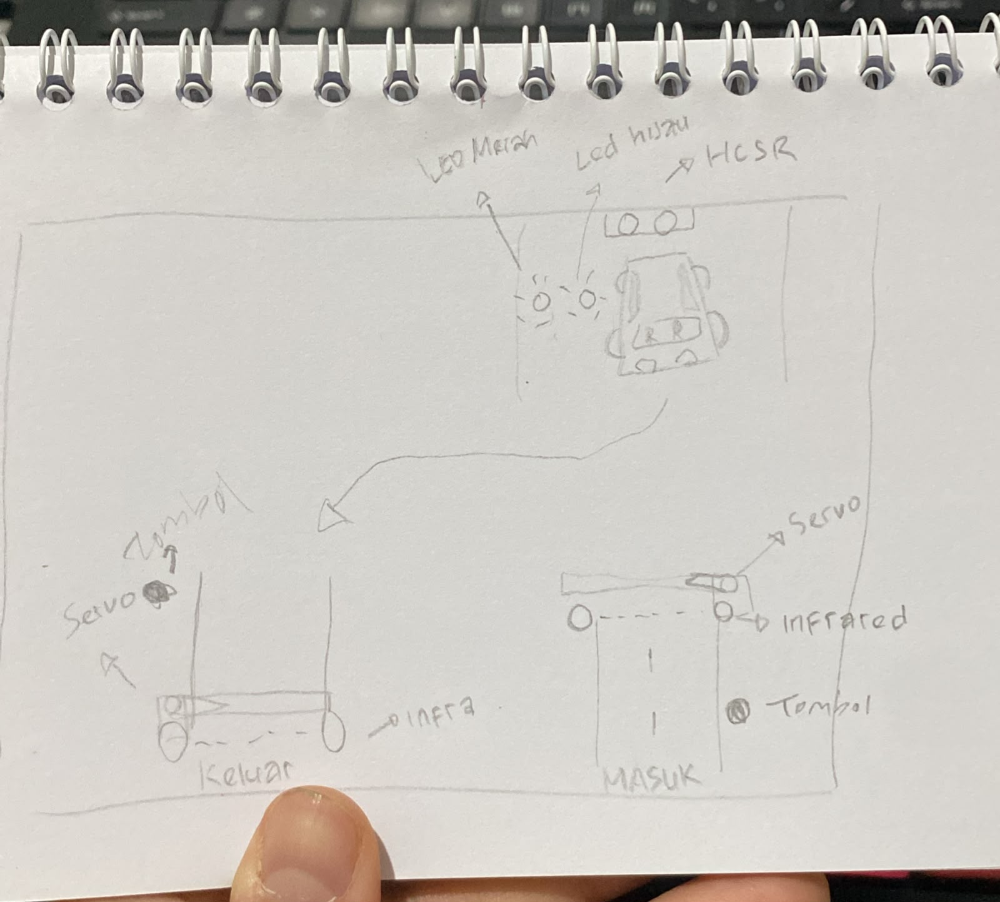

# Sistem Parkir IoT Berbasis ESP32 dan Blynk

## Deskripsi

Sistem Parkir IoT merupakan proyek monitoring dan kontrol parkir berbasis ESP32 yang memanfaatkan sensor ultrasonik HC-SR04 untuk mendeteksi ketersediaan slot parkir, sensor IR Beam untuk mendeteksi kendaraan yang melewati gerbang, serta aplikasi Blynk sebagai media monitoring secara real-time.

Proyek ini menyediakan simulasi menggunakan Wokwi dan implementasi nyata menggunakan ESP32, servo, sensor ultrasonik, sensor IR Beam, LED indikator, dan dashboard Blynk.

---

## Fitur

* Monitoring 2 slot parkir
* Indikator LED merah dan hijau pada setiap slot
* Deteksi kendaraan masuk dan keluar
* Kontrol palang parkir menggunakan servo
* Perhitungan jumlah kendaraan di area parkir
* Monitoring status parkir melalui aplikasi Blynk
* Informasi jumlah slot kosong dan terisi
* Notifikasi kondisi parkiran penuh

---

## Simulasi Wokwi

Link simulasi:

https://wokwi.com/projects/466676889969083393

---

## Arsitektur Sistem

### Kendaraan Masuk

1. Pengguna menekan tombol masuk.
2. Servo gerbang masuk terbuka.
3. Kendaraan melewati sensor IR Beam masuk.
4. Jumlah kendaraan di area parkir bertambah.
5. Servo gerbang masuk menutup kembali.

### Kendaraan Keluar

1. Pengguna menekan tombol keluar.
2. Servo gerbang keluar terbuka.
3. Kendaraan melewati sensor IR Beam keluar.
4. Jumlah kendaraan di area parkir berkurang.
5. Servo gerbang keluar menutup kembali.

### Monitoring Slot

* HC-SR04 Slot 1 mendeteksi kendaraan pada slot pertama.
* HC-SR04 Slot 2 mendeteksi kendaraan pada slot kedua.
* Jika jarak ≤ 10 cm maka slot dianggap terisi.
* Jika jarak > 10 cm maka slot dianggap kosong.

---

## Dashboard Blynk

| Virtual Pin | Keterangan           |
| ----------- | -------------------- |
| V0          | Status Slot 1        |
| V1          | Status Slot 2        |
| V2          | Jumlah Mobil di Area |
| V3          | Jumlah Slot Kosong   |
| V4          | Jumlah Slot Terisi   |
| V5          | Status Parkir        |

Status yang ditampilkan:

* TERSEDIA
* PARKIRAN PENUH

---

## Komponen

### Hardware

* ESP32 Dev Module
* 2x Servo Motor
* 2x HC-SR04 Ultrasonic Sensor
* 2x IR Beam Sensor
* 4x LED
* 4x Resistor 220Ω
* Adaptor 5V
* Push Button Masuk
* Push Button Keluar

### Software

* Visual Studio Code
* PlatformIO
* Arduino Framework
* Blynk IoT
* Wokwi Simulator

---

## Sketsa Project




---

## Catatan Implementasi

Sensor IR Beam yang digunakan pada implementasi nyata dapat memiliki logika aktif LOW atau aktif HIGH tergantung konfigurasi relay (NO/NC).

Pada kode saat ini digunakan asumsi:

```cpp
digitalRead(IR_MASUK) == LOW
digitalRead(IR_KELUAR) == LOW
```

Jika hasil pengujian menunjukkan logika terbalik, ubah kondisi tersebut menjadi:

```cpp
digitalRead(IR_MASUK) == HIGH
digitalRead(IR_KELUAR) == HIGH
```

---

## Pengembangan Selanjutnya

* Integrasi dashboard Blynk penuh
* Penyimpanan data parkir
* Riwayat kendaraan masuk dan keluar
* Monitoring multi-slot parkir
* Integrasi database dan web dashboard
* Notifikasi parkir penuh

```
```
